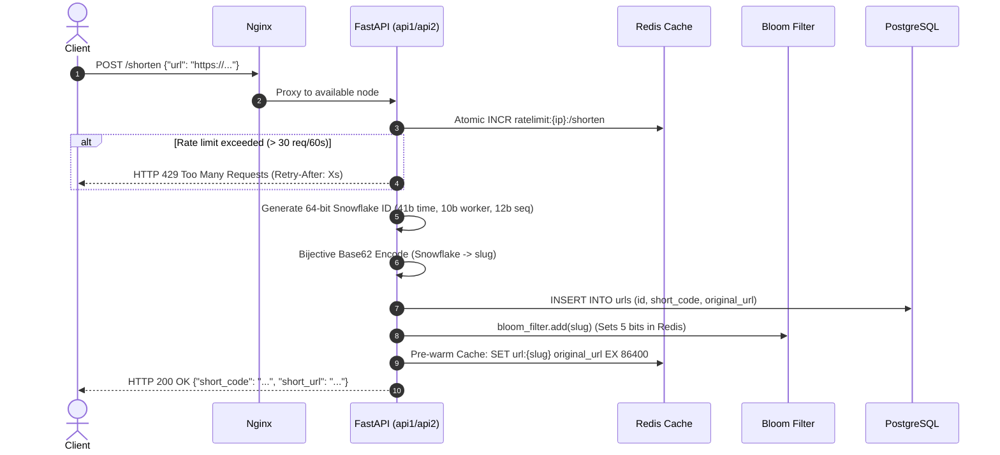

# ⚡ High-Availability Distributed URL Shortener

A production-grade, distributed URL shortener engineered for massive scale, sub-millisecond redirect latency, and zero single point of failure (SPOF).

Built with **FastAPI**, **PostgreSQL**, **Redis**, **RabbitMQ**, **Docker**, and **Nginx**.

---

## 🎯 The Problem: Why Not Just Build a Simple CRUD App?

Most naive URL shorteners use an auto-incrementing integer in PostgreSQL (`SELECT nextval(...)`), a simple random string generator (`uuid` or `random.choices()`), and write click events directly into the database on every visit.

Here is why that architecture collapses under production traffic—and how this system solves it:

| Challenge | Naive CRUD Approach | Our Distributed Architecture | Why This Matters |
| :--- | :--- | :--- | :--- |
| **ID Generation** | Auto-increment DB IDs or UUIDs | **64-bit Twitter Snowflake ID** | Auto-increment creates severe database write locks and reveals URL count to competitors. UUIDs are 128-bit strings that cause extreme B-Tree index fragmentation. Snowflake generates **4+ million chronologically monotonic IDs/sec per node** with zero database coordination. |
| **Slug Encoding** | Base64 or Hex hashes | **Bijective Base62 (`[0-9a-zA-Z]`)** | Base64 contains URL-unsafe characters (`+`, `/`, `=`). Base62 produces clean, compact, URL-safe slugs (e.g. `8WSNOZPM8MM`) without encoding issues. |
| **Redirect Latency** | SQL `SELECT` on every click (~15–50ms) | **Redis Cache-Aside Layer (`< 0.5ms`)** | 90%+ of reads hit in-memory Redis keys pre-warmed for 24 hours. The browser receives an instant `HTTP 302` redirect without touching disk. |
| **Cache Penetration Attacks** | Attackers query 1M fake URLs ➔ DB crashes | **Distributed Redis Bloom Filter (`0.1ms`)** | A probabilistic 1M-bit bitmap with 5 salted SHA-256 hashes filters non-existent URLs in 0.1ms (`X-Bloom: REJECT`) with zero false negatives, completely shielding PostgreSQL from malicious scans. |
| **Rate Limiting & Abuse** | Unprotected endpoints or memory lists | **Atomic Redis Sliding Window Limiter** | Prevents DDoS and bot brute-force on `POST /shorten` (30 req/min per IP) returning `HTTP 429` with dynamic `Retry-After` headers. |
| **Click Logging** | Synchronous SQL `INSERT` on redirect | **Asynchronous RabbitMQ Event Pipeline** | Writing analytics to disk on redirect slows down the user and locks tables. We emit a fire-and-forget message to RabbitMQ in 0.2ms. A background worker ingests events into PostgreSQL with `basic_ack` at-least-once delivery. |
| **High Availability** | Single API server (dies on crash) | **Nginx Active-Active Load Balancing** | Nginx distributes traffic across multiple stateless FastAPI nodes (`api1`, `api2`). If an instance dies mid-request, Nginx retries the surviving node transparently with **zero dropped requests**. |

---

## 🏛️ System Architecture

```mermaid
flowchart TD
    subgraph ClientLayer ["Client & Edge"]
        User["🌐 Client / Browser / curl"]
    end

    subgraph LoadBalancer ["Reverse Proxy & Ingress"]
        Nginx["⚖️ Nginx (Port 80)<br/>Active-Active Upstream & Instant Failover"]
    end

    subgraph AppCluster ["FastAPI Cluster (Stateless Compute)"]
        API1["⚡ FastAPI Instance 1<br/>Snowflake Node 1 · Base62"]
        API2["⚡ FastAPI Instance 2<br/>Snowflake Node 2 · Base62"]
    end

    subgraph DefenseAndCaching ["In-Memory Caching & Protection Layer"]
        RateLimit["⏱️ Redis Sliding Window Limiter<br/>(30 req/min per IP)"]
        Bloom["🛡️ Distributed Bloom Filter<br/>(1M bits · 5 Salted Hashes)"]
        RedisCache["⚡ Redis Cache (Port 6379)<br/>Cache-Aside & Pre-Warming (24h TTL)<br/>Atomic Click Counter (INCR)"]
    end

    subgraph MessagingAndAsync ["Asynchronous Event Processing Pipeline"]
        RabbitMQ["🐰 RabbitMQ Broker (Port 5672)<br/>Durable Queue: 'click_events'"]
        Worker["👷 Analytics Worker (app/worker.py)<br/>At-Least-Once Consumer (basic_ack)"]
    end

    subgraph DatabaseLayer ["Persistent Storage Layer"]
        Postgres["🐘 PostgreSQL 16 (Port 5432)<br/>Tables: 'urls' & 'click_events'"]
    end

    subgraph Observability ["Management & Dashboards"]
        RedisInsight["📊 RedisInsight (Port 5540)"]
        RabbitMQDashboard["📈 RabbitMQ Management (Port 15672)"]
    end

    User -->|HTTP Requests| Nginx
    Nginx -->|Round-Robin| API1
    Nginx -->|Round-Robin| API2

    API1 & API2 -->|Enforce limits| RateLimit
    API1 & API2 -->|Fast read (0.2ms)| RedisCache
    API1 & API2 -->|Reject fake slugs (0.1ms)| Bloom
    API1 & API2 -->|Fire-and-forget click event| RabbitMQ
    API1 & API2 -->|Cache Miss / BYPASS fallback| Postgres

    RabbitMQ -->|Pushes events (prefetch=1)| Worker
    Worker -->|Batch Inserts Click Events| Postgres

    RedisCache -.->|Monitored by| RedisInsight
    RabbitMQ -.->|Monitored by| RabbitMQDashboard
```

---

## 🔄 Detailed Request Lifecycles

### 1. URL Creation (`POST /shorten`)


### 2. URL Redirect & Analytics Pipeline (`GET /{short_code}`)

```mermaid
sequenceDiagram
    autonumber
    actor Visitor
    participant Nginx
    participant API as FastAPI (api1/api2)
    participant RabbitMQ as RabbitMQ Queue
    participant Redis as Redis Cache
    participant Bloom as Bloom Filter
    participant DB as PostgreSQL
    participant Worker as Background Worker

    Visitor->>Nginx: GET /{short_code}
    Nginx->>API: Proxy to available node
    
    rect rgb(20, 24, 33)
        note over API,RabbitMQ: Non-Blocking Event Publishing (~0.2ms)
        API-)RabbitMQ: publish_click_event(slug, ip, user_agent, referer)
    end

    API->>Redis: GET url:{short_code}
    alt Cache HIT (In-Memory ~0.2ms)
        API-->>Visitor: HTTP 302 Found (X-Cache: HIT, Location: target)
    else Cache MISS
        API->>Bloom: bloom_filter.contains(short_code)?
        alt Definite Negative (Bit = 0)
            API-->>Visitor: HTTP 404 Not Found (X-Bloom: REJECT)
        else Possible Positive (Bits = 1)
            API->>DB: SELECT * FROM urls WHERE short_code = ...
            alt Found in DB
                API->>Redis: SET url:{code} target_url EX 86400
                API-->>Visitor: HTTP 302 Found (X-Cache: MISS)
            else 404 False Positive
                API-->>Visitor: HTTP 404 Not Found
            end
        end
    end

    rect rgb(20, 24, 33)
        note over RabbitMQ,DB: Asynchronous DB Write in Background
        RabbitMQ->>Worker: Push message (prefetch=1)
        Worker->>DB: INSERT INTO click_events (url_id, ip, ua, referer)
        Worker-->>RabbitMQ: basic_ack (Delivery Confirmed)
    end
```


---

## 🛠️ Port & Service Directory

| Service | Container Name | Host Port | Protocol / Purpose |
| :--- | :--- | :---: | :--- |
| **Nginx Ingress** | `url_shortener_nginx` | **`80`** | Public HTTP entrypoint, reverse proxy, round-robin load balancer |
| **FastAPI Node 1** | `url_shortener_api1` | `8000` (Internal) | Stateless API instance (Machine ID: 1) |
| **FastAPI Node 2** | `url_shortener_api2` | `8000` (Internal) | Stateless API instance (Machine ID: 2) |
| **Analytics Worker** | `url_shortener_worker` | — | Background RabbitMQ consumer (writes to PostgreSQL) |
| **RabbitMQ Broker** | `url_shortener_rabbitmq` | **`5672`** | AMQP messaging protocol |
| **RabbitMQ Management** | `url_shortener_rabbitmq` | **`15672`** | Web dashboard (`guest` / `guest`) |
| **Redis Cache** | `url_shortener_redis` | **`6379`** | In-memory cache, rate limiter, and Bloom filter bitmap |
| **RedisInsight** | `redis_insight_ui` | **`5540`** | Visual Redis database browser |
| **PostgreSQL Database**| `url_shortener_db` | **`5432`** | Persistent relational storage (`urls` and `click_events`) |

---

## 🚀 How to Run

### Option 1: Run Full Cluster with Docker Compose (Recommended)

Requires [Docker Desktop](https://www.docker.com/products/docker-desktop/).

```bash
# Clone the repository
git clone https://github.com/your-username/url-shortner.git
cd url-shortner

# Start all 8 containers in the background
docker compose up -d --build
```

Access the services in your browser:
* **Web UI (Shorten & QR code)**: [http://localhost/](http://localhost/)
* **Interactive API Docs (Swagger UI)**: [http://localhost/docs](http://localhost/docs)
* **RabbitMQ Dashboard**: [http://localhost:15672](http://localhost:15672) (User: `guest`, Pass: `guest`)
* **RedisInsight Dashboard**: [http://localhost:5540](http://localhost:5540)

---

### Option 2: Run Locally (Python + UV)

If you have PostgreSQL, Redis, and RabbitMQ running locally:

```bash
# Install dependencies using uv
uv sync

# Run database migrations / start API
uv run uvicorn app.main:app --reload --port 8000

# In a separate terminal, start the background worker
uv run python -m app.worker
```

---

## 🧪 Comprehensive Automated Test Suites

Each component includes an automated verification test suite:

```bash
# 1. Benchmark Snowflake Generator (10,000 unique IDs @ 1.35M/sec, 0 collisions)
uv run python test_snowflake_10k.py

# 2. Test Redis Cache-Aside, Hit/Miss, Atomic INCR, and Database Fallback
uv run python test_redis.py

# 3. Chaos Engineering: Test Nginx load balancing and kill API1 with 0 dropped requests
uv run python test_cluster.py

# 4. Test RabbitMQ Asynchronous Analytics Pipeline & Worker basic_ack
uv run python test_rabbitmq.py

# 5. Test Distributed Bloom Filter (0.1ms rejection) & Rate Limiting (HTTP 429)
uv run python test_phase8.py
```

---

## 🌐 100% Free Lifetime Cloud Deployment

The repository is pre-configured with **Infrastructure-as-Code** for 100% free lifetime deployment using serverless providers:

| Component | Free Cloud Provider | Free Tier Allowance | How It's Configured |
| :--- | :--- | :--- | :--- |
| **PostgreSQL** | [Neon.tech](https://neon.tech) | 0.5 GB serverless storage, auto-scaling | Managed via `neon.ts` policy (`neon deploy`) with connection pooling |
| **Redis** | [Upstash](https://upstash.com) | 10,000 commands/day, serverless with TLS | Single-client TLS connection in `app/redis_client.py` |
| **RabbitMQ** | [CloudAMQP](https://www.cloudamqp.com) ("Little Lemur") | 1,000,000 messages/month, 20 max connections | Persistent singleton connection pool in `app/rabbitmq_client.py` |
| **Compute & UI** | [Render.com](https://render.com) or [Koyeb](https://koyeb.com) | 1 Free container (`512MB RAM`) | 1-Click deploy via [`render.yaml`](./render.yaml) (`RUN_WORKER_IN_BACKGROUND=true`) |

### Deploy to Render in 2 Minutes:
1. Push this repo to your GitHub.
2. In [Render Dashboard](https://dashboard.render.com), click **New ➔ Blueprint** and select your repository.
3. Render automatically loads [`render.yaml`](./render.yaml), builds the Docker container, and launches the app!

👉 *For detailed setup and credentials walkthrough, see the [`FREE_DEPLOYMENT_GUIDE.md`](./FREE_DEPLOYMENT_GUIDE.md).*

---

## 📚 API Reference

### 1. Shorten a URL
* **URL**: `POST /shorten`
* **Rate Limit**: 30 requests/minute per client IP
* **Request Body**:
  ```json
  {
    "url": "https://en.wikipedia.org/wiki/Distributed_computing"
  }
  ```
* **Response (HTTP 200)**:
  ```json
  {
    "short_code": "8WSNOZPM8MM",
    "short_url": "http://localhost/8WSNOZPM8MM",
    "original_url": "https://en.wikipedia.org/wiki/Distributed_computing"
  }
  ```

### 2. Redirect to Target
* **URL**: `GET /{short_code}`
* **Response**: `HTTP 302 Found` with target URL in `Location` header.
* **Headers**:
  * `X-Cache`: `HIT` (served from Redis) or `MISS` (fetched from PostgreSQL) or `BYPASS` (Redis down).
  * `X-Bloom`: `PASS` (valid key) or `REJECT` (blocked instantly as non-existent).
  * `X-Handled-By`: `api1` or `api2` (indicates which node processed the request).

### 3. Click Counter & URL Info
* **URL**: `GET /stats/{short_code}`
* **Response (HTTP 200)**:
  ```json
  {
    "short_code": "8WSNOZPM8MM",
    "original_url": "https://en.wikipedia.org/...",
    "clicks": 42
  }
  ```

### 4. Full Historical Analytics
* **URL**: `GET /analytics/{short_code}`
* **Response (HTTP 200)**:
  ```json
  {
    "short_code": "8WSNOZPM8MM",
    "total_clicks": 3,
    "recent_events": [
      {
        "id": 81,
        "clicked_at": "2026-10-01T19:56:10.862113Z",
        "ip_address": "127.0.0.1",
        "user_agent": "Mozilla/5.0 ...",
        "referer": "https://reddit.com"
      }
    ]
  }
  ```

### 5. Health Check
* **URL**: `GET /health`
* **Response (HTTP 200)**:
  ```json
  {
    "status": "ok",
    "service": "url-shortener"
  }
  ```

---

## 📄 License
MIT License. Free to use, fork, and adapt for interview preparation, production deployments, and systems engineering benchmarks.
