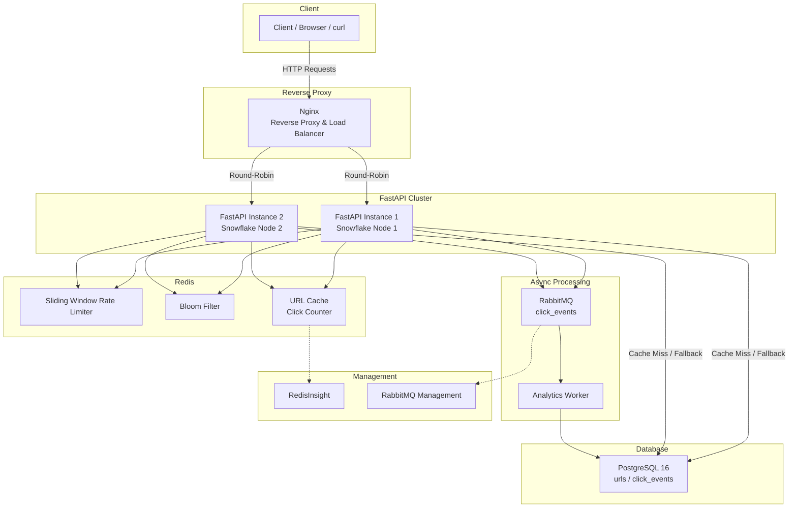
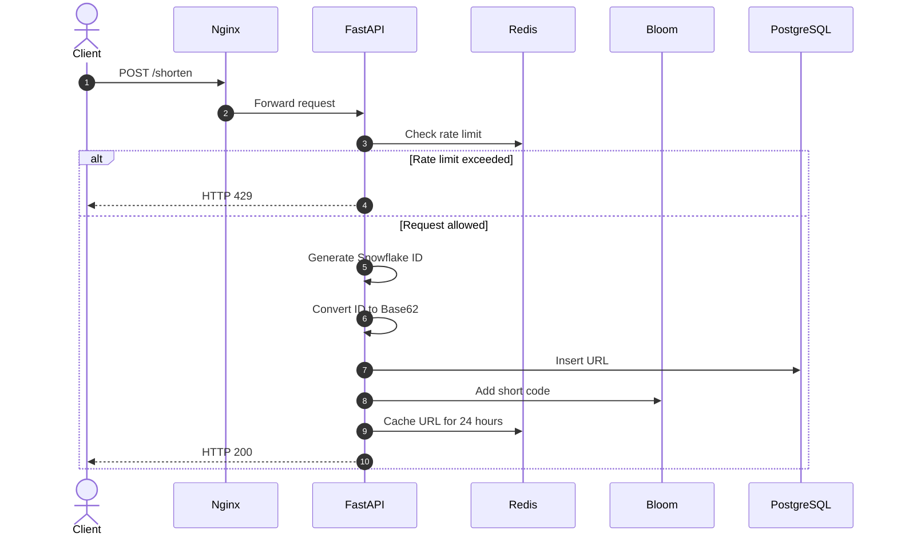
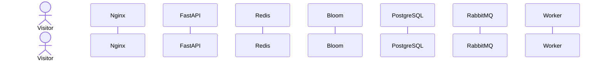
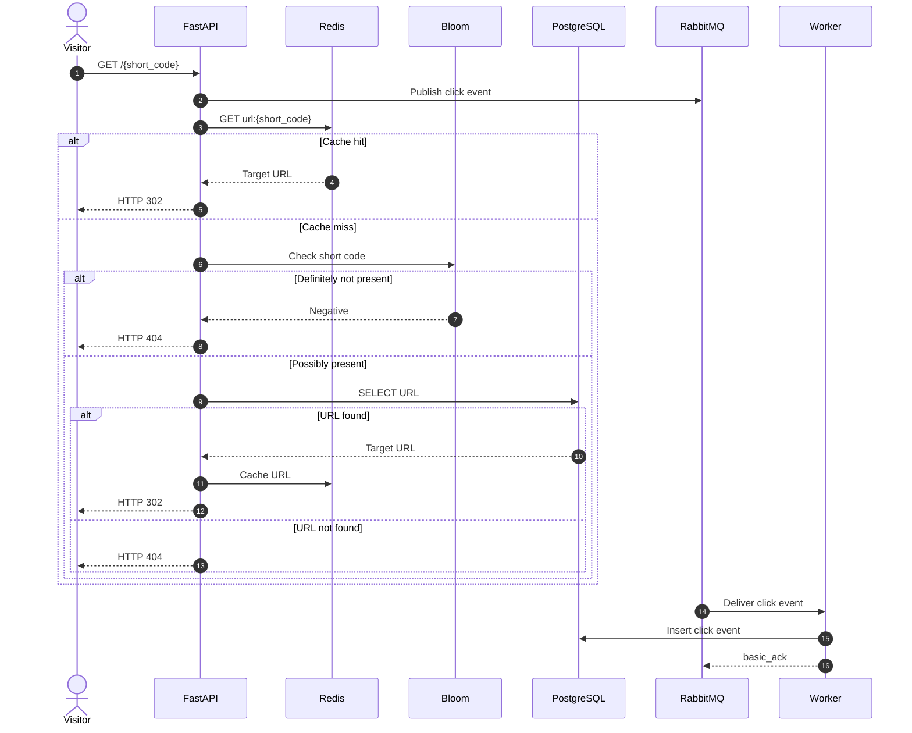

# Distributed URL Shortener

A distributed URL shortener built with FastAPI, PostgreSQL, Redis, RabbitMQ, Docker, and Nginx.

The project focuses on fast redirects, distributed ID generation, caching, rate limiting, asynchronous click tracking, and running multiple API instances behind a load balancer.

## Why this architecture?

A basic URL shortener can be implemented with a database table, an auto-incrementing ID, and a redirect endpoint. That approach works for a small application, but it becomes less suitable as traffic increases.

This project separates the main responsibilities across several components:

| Problem | Basic approach | This project |
|---|---|---|
| ID generation | PostgreSQL auto-increment or UUID | 64-bit Snowflake IDs |
| Short code | Hash or Base64 encoding | Bijective Base62 |
| Redirect lookup | Query PostgreSQL for every request | Redis cache with PostgreSQL fallback |
| Invalid URL requests | Send every request to the database | Redis Bloom filter |
| Rate limiting | Application-level or no limit | Redis-based sliding window |
| Click tracking | Write directly to PostgreSQL | RabbitMQ with background processing |
| API availability | Single API instance | Multiple FastAPI instances behind Nginx |

The goal is to keep the redirect path lightweight while moving analytics and other non-critical work away from the request itself.

## Architecture



### Components

- **Nginx** handles incoming HTTP requests and distributes them between the API instances.
- **FastAPI** provides the URL shortening, redirect, statistics, analytics, and health-check endpoints.
- **Redis** is used for URL caching, rate limiting, the Bloom filter, and atomic click counters.
- **RabbitMQ** receives click events so analytics processing does not block redirects.
- **PostgreSQL** stores URLs and historical click events.
- **The analytics worker** consumes RabbitMQ messages and writes click events to PostgreSQL.
- **RedisInsight** and **RabbitMQ Management** provide basic service monitoring.

## Request flow

### 1. Creating a short URL

The client sends a URL to `POST /shorten`.



The API first checks the client's rate limit using Redis.

If the request is allowed, the API generates a 64-bit Snowflake ID. The ID contains a timestamp, worker ID, and sequence number. The resulting ID is then converted to a Base62 string to create the short code.

The URL is stored in PostgreSQL, added to the Bloom filter, and placed in Redis with a 24-hour TTL.

The client receives the generated short URL.

### 2. Redirecting a short URL

When someone visits a short URL, the API first checks Redis.



The redirect flow is:

1. The request reaches Nginx.
2. Nginx forwards it to one of the FastAPI instances.
3. The API publishes the click event to RabbitMQ.
4. Redis is checked for the short code.
5. If the URL is cached, it is returned immediately.
6. If it is not cached, the Bloom filter is checked.
7. If the Bloom filter confirms that the key does not exist, the API returns `404`.
8. If the Bloom filter indicates that the key may exist, PostgreSQL is queried.
9. A successful database lookup is added back to Redis.
10. The API returns an HTTP `302` redirect.

The click event is processed separately by the background worker.



## ID generation

The service uses a 64-bit Snowflake-style ID generator.

The ID is divided into:

- 41 bits for the timestamp
- 10 bits for the worker or machine ID
- 12 bits for the sequence number

Each API instance has its own worker ID, allowing multiple instances to generate IDs without coordinating with PostgreSQL for every request.

The generated ID is converted into Base62 before being returned as the short code.

## Base62 encoding

The short code uses the following character set:

```text
0123456789abcdefghijklmnopqrstuvwxyzABCDEFGHIJKLMNOPQRSTUVWXYZ
```

Base62 keeps the generated codes relatively short while avoiding characters that can cause problems in URLs.

For example:

```text
Snowflake ID
     ↓
Base62 encoding
     ↓
8WSNOZPM8MM
```

The encoding is bijective, so the numeric ID can be converted to a Base62 representation without losing information.

## Redis caching

Redis is used as a cache-aside layer.

For a redirect:

```text
Request
   ↓
Redis GET
   ↓
 ┌───────────────┐
 │ Cache hit?    │
 └───────┬───────┘
         │
    Yes  │  No
     ↓   │   ↓
 Redirect  Bloom Filter
             ↓
        PostgreSQL
             ↓
       Redis SET
             ↓
          Redirect
```

URLs are cached for 24 hours.

The cache also provides atomic counters using Redis `INCR` and is used by the rate limiter and Bloom filter.

## Bloom filter

A Bloom filter is used to avoid unnecessary database queries for short codes that definitely do not exist.

The filter is stored in Redis and uses multiple salted SHA-256 hashes.

The important property is that a Bloom filter can say:

- **Definitely not present**
- **Possibly present**

It cannot guarantee that a positive result actually exists in PostgreSQL, so a positive result still requires a database lookup.

For example:

```text
GET /doesnotexist

        ↓
     Redis Cache
        ↓
     Cache Miss
        ↓
   Bloom Filter
        ↓
   Definitely No
        ↓
      HTTP 404
```

This prevents large numbers of invalid requests from reaching PostgreSQL.

## Rate limiting

The `POST /shorten` endpoint uses a Redis-based sliding-window rate limiter.

The current limit is:

```text
30 requests per minute per IP
```

When the limit is exceeded, the API returns:

```text
HTTP 429 Too Many Requests
```

along with a `Retry-After` header.

The counter is stored in Redis so that the limit is shared between the API instances.

## Asynchronous click tracking

Click events are not written directly to PostgreSQL during the redirect request.

Instead, the API publishes an event to RabbitMQ containing information such as:

```text
short code
IP address
user agent
referer
```

The background worker consumes these messages and inserts them into PostgreSQL.

This keeps the redirect path separate from the analytics write.

The worker uses RabbitMQ acknowledgements so that messages are acknowledged after processing.

## High availability

Nginx distributes requests between two stateless FastAPI instances:

```text
                 Nginx
                /     \
               /       \
          API 1        API 2
```

Both instances use the same Redis, RabbitMQ, and PostgreSQL services.

Because the API instances do not keep application state locally, additional instances can be added behind the load balancer when needed.

## Services and ports

| Service | Container | Port | Purpose |
|---|---|---:|---|
| Nginx | `url_shortener_nginx` | `80` | Reverse proxy and load balancer |
| FastAPI Node 1 | `url_shortener_api1` | `8000` internal | API instance |
| FastAPI Node 2 | `url_shortener_api2` | `8000` internal | API instance |
| Analytics Worker | `url_shortener_worker` | — | RabbitMQ consumer |
| RabbitMQ | `url_shortener_rabbitmq` | `5672` | Message broker |
| RabbitMQ Management | `url_shortener_rabbitmq` | `15672` | RabbitMQ dashboard |
| Redis | `url_shortener_redis` | `6379` | Cache, rate limiter, Bloom filter |
| RedisInsight | `redis_insight_ui` | `5540` | Redis dashboard |
| PostgreSQL | `url_shortener_db` | `5432` | Persistent storage |

## Running the project

### Docker Compose

The easiest way to run the complete stack is with Docker Compose.

You need Docker Desktop installed first.

```bash
git clone https://github.com/your-username/url-shortner.git
cd url-shortner

docker compose up -d --build
```

The main services can then be accessed at:

```text
Web UI:
http://localhost/

Swagger:
http://localhost/docs

RabbitMQ Management:
http://localhost:15672

RedisInsight:
http://localhost:5540
```

The RabbitMQ dashboard uses:

```text
Username: guest
Password: guest
```

### Running locally with UV

If PostgreSQL, Redis, and RabbitMQ are already running locally:

```bash
uv sync
```

Start the API:

```bash
uv run uvicorn app.main:app --reload --port 8000
```

Start the worker in another terminal:

```bash
uv run python -m app.worker
```

## Testing

The project includes separate tests for the main components.

### Snowflake generator

```bash
uv run python test_snowflake_10k.py
```

This tests the generation of 10,000 IDs and checks for collisions.

### Redis

```bash
uv run python test_redis.py
```

This covers the cache hit/miss behaviour, atomic `INCR`, and database fallback.

### Nginx cluster

```bash
uv run python test_cluster.py
```

This tests the API instances behind Nginx and verifies the behaviour when one API instance is stopped.

### RabbitMQ

```bash
uv run python test_rabbitmq.py
```

This tests the asynchronous click-event pipeline and worker acknowledgements.

### Bloom filter and rate limiting

```bash
uv run python test_phase8.py
```

This tests Bloom filter rejection and rate limiting behaviour.

## Cloud deployment

The repository also contains configuration for deploying the application using free-tier services.

| Component | Provider | Free-tier configuration |
|---|---|---|
| PostgreSQL | Neon | 0.5 GB serverless storage |
| Redis | Upstash | 10,000 commands/day |
| RabbitMQ | CloudAMQP | 1,000,000 messages/month |
| Compute | Render or Koyeb | Free container |

The deployment configuration is included in the repository.

### Render deployment

1. Push the repository to GitHub.
2. Open the Render dashboard.
3. Select **New → Blueprint**.
4. Select the repository.
5. Render reads the `render.yaml` configuration and starts the application.

For the complete deployment and credentials setup, see:

```text
FREE_DEPLOYMENT_GUIDE.md
```

## API

### 1. Shorten a URL

```text
POST /shorten
```

Rate limit:

```text
30 requests/minute per client IP
```

Request:

```json
{
  "url": "https://en.wikipedia.org/wiki/Distributed_computing"
}
```

Response:

```json
{
  "short_code": "8WSNOZPM8MM",
  "short_url": "http://localhost/8WSNOZPM8MM",
  "original_url": "https://en.wikipedia.org/wiki/Distributed_computing"
}
```

### 2. Redirect

```text
GET /{short_code}
```

A successful request returns:

```text
HTTP 302 Found
```

The target URL is returned in the `Location` header.

The API also exposes:

```text
X-Cache
```

with one of:

```text
HIT
MISS
BYPASS
```

The Bloom filter status is available through:

```text
X-Bloom
```

with:

```text
PASS
REJECT
```

The API instance that handled the request is returned through:

```text
X-Handled-By
```

For example:

```text
api1
api2
```

### 3. URL statistics

```text
GET /stats/{short_code}
```

Example response:

```json
{
  "short_code": "8WSNOZPM8MM",
  "original_url": "https://en.wikipedia.org/...",
  "clicks": 42
}
```

### 4. Historical analytics

```text
GET /analytics/{short_code}
```

Example response:

```json
{
  "short_code": "8WSNOZPM8MM",
  "total_clicks": 3,
  "recent_events": [
    {
      "id": 81,
      "clicked_at": "2026-10-01T19:56:10.862113Z",
      "ip_address": "127.0.0.1",
      "user_agent": "Mozilla/5.0 ...",
      "referer": "https://reddit.com"
    }
  ]
}
```

### 5. Health check

```text
GET /health
```

Example response:

```json
{
  "status": "ok",
  "service": "url-shortener"
}
```

## Project structure

The main components are separated by responsibility:

```text
app/
├── main.py
├── worker.py
├── redis_client.py
└── rabbitmq_client.py
```

The exact project structure may contain additional modules depending on the current implementation.

## License

MIT License.

Free to use, fork, and modify for learning, interview preparation, and other projects.
